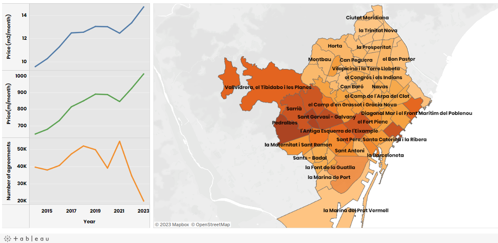

# Data Analytics Mid-Bootcamp Project: Rental prices in Barcelona
***

## Table of Contents
1. [Project Overview](#project-overview)
2. [Screenshot](#screenshot)
3. [Data Sources](#data-sources)
4. [Hypotheses](#hypotheses)
5. [Data to Analyze](#data-to-analyze)
6. [Analysis](#analysis)
7. [Machine Learning](#machine-learning)
8. [Technologies and tools](#technologies-and-tools)
9. [Conclusion](#conclusion)
10. [Contributors](#contributors)

## Project Overview
This project focuses on analyzing the trends in rental prices in Barcelona over the past 10 years, with the aim of understanding the housing market dynamics. The primary questions to be addressed include the evolution of rental prices, identification of seasonal patterns, and the correlation between the number of contracts and price trends.

## Screenshot

## Data Sources
The project utilizes data from the Barcelona City Council's open data portal:
- [Average Monthly Rental Prices](https://opendata-ajuntament.barcelona.cat/data/en/dataset/est-mercat-immobiliari-lloguer-mitja-mensual)
- [Number of Rental Contracts](https://opendata-ajuntament.barcelona.cat/data/ca/dataset/est-mercat-immobiliari-lloguer-nombre-contractes/resource/951ee1a0-5105-4e8c-a459-3ef7b7cc2ed6?inner_span=True)

## Hypotheses
1. Rental prices have significantly increased over the last 10 years.
2. Consistent seasonal patterns exist in rental prices.
3. Special events, such as the pandemic, can be detected in the data.

## Data to Analyze
1. Quarterly average rental prices by neighborhood over the last decade.
2. Quarterly information on prices per square meter.
3. Quarterly data on the number of rental contracts.

## Analysis
### General Temporal Analysis:
- Examine overall trends in rental prices in the city over the last decade.
- Identify steady increases, fluctuations, and changes in the number of contracts.

### Analysis by Districts/Neighborhoods:
- Analyze data by districts or neighborhoods to identify specific variations.
- Compare trends in selected neighborhoods to the city average.

### Seasonal Analysis:
- Use statistical methods to identify seasonal patterns in rental prices.
- Examine specific quarters for consistent increases or decreases in prices and contracts.

## Machine Learning
Utilize various machine learning models and compare validations for predictive analysis.

## Technologies and tools 
The project development utilized the following technologies:
- Jupyter notebook for data analysis and model building.
- SQL Workbench for database interaction.
- [Tableau for data visualization](https://public.tableau.com/app/profile/laia.g.mez.mess.a/viz/RentalpricesinBarcelona/Dashboard2?publish=yes)

### Python Libraries Used
- pandas, numpy for data manipulation.
- seaborn, matplotlib for data visualization.
- scikit-learn for machine learning models.
- SQLAlchemy for database connectivity.
- LightGBM, GradientBoostingRegressor, KNeighborsRegressor, LinearRegression, MLPRegressor, and more for machine learning.

### Statistical Analysis
- Statistical methods, including t-tests, used for hypothesis testing.

## Conclusion
This project aims to provide a comprehensive analysis of the rental market in Barcelona, utilizing a combination of statistical methods, machine learning models, and visualizations. The findings will contribute to a deeper understanding of housing trends and patterns in the city over the past decade.

## Contributors
- [Laia Gómez Messía](https://github.com/laiagomezmessia)

